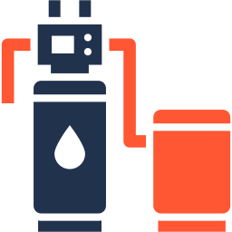

# Erie Water Treatment IQ26 — Home Assistant Integration

<p align="center">
  
</p>

[](https://hacs.xyz)
[](https://www.home-assistant.io)
[](LICENSE)

A Home Assistant custom integration for **Erie IQ26 water softeners** managed via the **Connect My Softener** app (Erie Connect / Pentair cloud API).

Polls the cloud API every 120 seconds and exposes 15 sensors and 6 binary sensors — including remaining softening capacity, days until regeneration, water consumption for the Energy Dashboard, and per-category warning binary sensors.

> Forked from [tgebarowski/erie-watertreatment-homeassistant](https://github.com/tgebarowski/erie-watertreatment-homeassistant) and extended with additional sensors, device page support, and HACS compatibility.

---

## Compatibility

| | |
|---|---|
| **Mobile app** | Connect My Softener (iOS / Android) |
| **Cloud service** | Erie Connect (Pentair) |
| **Supported device** | Erie IQ26 water softener |
| **Protocol** | Cloud polling every 120 s — no local LAN access required |

This integration uses the same **Erie Connect** cloud account as the Connect My Softener app.
If your softener is already set up and visible in the app, it works here immediately — no extra registration needed.

---

## Features

- **Device page** — all entities grouped under one device card showing Name, Manufacturer, Model, Firmware version and Serial Number
- **Energy Dashboard** — cumulative water consumption sensor compatible with HA's built-in water panel
- **Live capacity sensors** — remaining %, remaining litres, days until next regeneration (direct from device firmware)
- **Warning binary sensors** — individual sensors per warning category (salt, filter, service, error) plus a catch-all
- **Derived time sensors** — days since last regeneration, days since last maintenance (calculated locally)
- **Holiday mode** — binary sensor that turns on when the softener is in bypass mode
- **Custom templates** — ready-to-paste YAML for template sensors, automations, and a full Lovelace dashboard

---

## Installation

### Option A — HACS (recommended)

1. Open **HACS** in Home Assistant → **Integrations**.
2. Click the ⋮ menu → **Custom repositories**.
3. Add `https://github.com/kiranbhakre/erie-watertreatment` with category **Integration**.
4. Search for **Erie Water Treatment IQ26** and click **Download**.
5. Restart Home Assistant.

### Option B — Manual

1. Download the [latest release](https://github.com/kiranbhakre/erie-watertreatment/releases) or clone this repo.
2. Copy the `custom_components/erie_watertreatment/` folder into your HA config:
   ```
   <ha-config-dir>/custom_components/erie_watertreatment/
   ```
3. Restart Home Assistant.

---

## Setup

1. Go to **Settings → Devices & Services → Add Integration**.
2. Search for **Erie Water Treatment IQ26**.
3. Enter your **Erie Connect** (Pentair) email and password.
   > 💡 Use the same email and password you use to log in to the **Connect My Softener** app.
4. The integration authenticates and selects the first active device automatically.

The device will appear under **Settings → Devices & Services** with all sensors and binary sensors grouped on one device page.

---

## Sensors

### Live Status (from dashboard API)

| Entity | Description | Unit |
|---|---|---|
| `sensor.erie_watertreatment_status_title` | Current device status, e.g. `In Service`, `Regenerating` | — |
| `sensor.erie_watertreatment_remaining_percentage` | Remaining softening capacity | % |
| `sensor.erie_watertreatment_remaining_litres` | Remaining softening capacity | L |
| `sensor.erie_watertreatment_days_remaining` | Days until the next auto-regeneration (from device firmware) | d |

### Water Usage

| Entity | Description | Unit |
|---|---|---|
| `sensor.erie_watertreatment_water_consumption` | Cumulative total volume — **Energy Dashboard compatible** | L |
| `sensor.erie_watertreatment_water_flow_rate` | Instantaneous flow rate (L/h), calculated between polls | L/h |
| `sensor.erie_watertreatment_total_volume` | Raw cumulative volume from the API | L |
| `sensor.erie_watertreatment_flow` | Volume delta since the previous poll | L |

### Maintenance & History

| Entity | Description | Unit |
|---|---|---|
| `sensor.erie_watertreatment_days_since_regeneration` | Days elapsed since the last regeneration cycle | d |
| `sensor.erie_watertreatment_days_since_maintenance` | Days elapsed since the last service visit | d |
| `sensor.erie_watertreatment_regeneration_count` | Total regeneration cycles since installation | — |
| `sensor.erie_watertreatment_last_regeneration` | ISO timestamp of the last regeneration | — |
| `sensor.erie_watertreatment_last_maintenance` | ISO date of the last maintenance visit | — |
| `sensor.erie_watertreatment_nr_regenerations` | Raw regeneration count string from the API | — |

### Warnings

| Entity | Description |
|---|---|
| `sensor.erie_watertreatment_warnings` | All active warnings as a formatted multi-line string |

---

## Binary Sensors

| Entity | Description | Device class |
|---|---|---|
| `binary_sensor.erie_watertreatment_low_salt` | On when any warning mentions salt | `problem` |
| `binary_sensor.erie_watertreatment_filter_warning` | On when any warning mentions "filter" | `problem` |
| `binary_sensor.erie_watertreatment_service_warning` | On when any warning mentions "service" | `problem` |
| `binary_sensor.erie_watertreatment_error_warning` | On when any warning mentions "error" | `problem` |
| `binary_sensor.erie_watertreatment_any_warning` | On when any warning is active | `problem` |
| `binary_sensor.erie_watertreatment_holiday_mode` | On when the softener is in bypass/holiday mode | `running` |

---

## Energy Dashboard

Add `sensor.erie_watertreatment_water_consumption` to the HA Energy Dashboard water panel:

1. **Settings → Energy → Water** → **Add Water Source**
2. Select `sensor.erie_watertreatment_water_consumption`
3. Set unit to **Litres (L)**

This sensor uses `device_class: water` and `state_class: total_increasing`, which is exactly what the HA Energy Dashboard requires for hourly / daily / monthly water statistics.

---

## Screenshots


---

## Lovelace Cards

Copy-paste any of the cards below into **Dashboard → Edit → Add Card → Manual**.  
> Verify entity IDs first: **Settings → Devices & Services → Erie Water Treatment IQ26 → entities**

---

### 1 — Full Dashboard (vertical stack — paste as one card)

```yaml
type: vertical-stack
cards:

  # ── Status & Capacity ───────────────────────────────────────────────────────
  - type: entities
    title: Erie Water Softener
    icon: mdi:water-pump
    entities:
      - entity: sensor.erie_watertreatment_status_title
        name: Status
        icon: mdi:information-outline
      - entity: sensor.erie_watertreatment_remaining_percentage
        name: Remaining Capacity
        icon: mdi:percent
      - entity: sensor.erie_watertreatment_remaining_litres
        name: Remaining Litres
        icon: mdi:water
      - entity: sensor.erie_watertreatment_days_remaining
        name: Days Until Regeneration
        icon: mdi:calendar-clock
      - entity: binary_sensor.erie_watertreatment_holiday_mode
        name: Holiday / Bypass Mode
        icon: mdi:palm-tree

  # ── Capacity gauge ──────────────────────────────────────────────────────────
  - type: gauge
    entity: sensor.erie_watertreatment_remaining_percentage
    name: Softening Capacity
    min: 0
    max: 100
    needle: true
    severity:
      green: 30
      yellow: 15
      red: 0

  # ── Water Usage ─────────────────────────────────────────────────────────────
  - type: entities
    title: Water Usage
    icon: mdi:water-pump
    entities:
      - entity: sensor.erie_watertreatment_water_consumption
        name: Total Consumption (cumulative)
        icon: mdi:counter
      - entity: sensor.erie_watertreatment_water_flow_rate
        name: Current Flow Rate
        icon: mdi:waves-arrow-right

  # ── Water usage history bar chart ───────────────────────────────────────────
  - type: statistics-graph
    title: Water Usage — Last 7 Days
    entities:
      - entity: sensor.erie_watertreatment_water_consumption
        name: Water
    stat_types:
      - sum
    period: day
    days_to_show: 7
    chart_type: bar

  # ── Maintenance ─────────────────────────────────────────────────────────────
  - type: entities
    title: Maintenance
    icon: mdi:wrench
    entities:
      - entity: sensor.erie_watertreatment_days_since_regeneration
        name: Days Since Regeneration
        icon: mdi:calendar-refresh
      - entity: sensor.erie_watertreatment_days_since_maintenance
        name: Days Since Maintenance
        icon: mdi:calendar-check
      - entity: sensor.erie_watertreatment_regeneration_count
        name: Total Regenerations
        icon: mdi:counter

  # ── Warnings (shown only when active) ───────────────────────────────────────
  - type: conditional
    conditions:
      - condition: state
        entity: binary_sensor.erie_watertreatment_any_warning
        state: "on"
    card:
      type: entities
      title: Active Warnings
      icon: mdi:alert
      entities:
        - entity: sensor.erie_watertreatment_warnings
          name: Warning Details
          icon: mdi:alert-circle

  # ── Warning sensors glance ──────────────────────────────────────────────────
  - type: glance
    title: Warning Sensors
    show_state: true
    entities:
      - entity: binary_sensor.erie_watertreatment_low_salt
        name: Low Salt
        icon: mdi:shaker-outline
      - entity: binary_sensor.erie_watertreatment_filter_warning
        name: Filter
        icon: mdi:air-filter
      - entity: binary_sensor.erie_watertreatment_service_warning
        name: Service
        icon: mdi:account-wrench
      - entity: binary_sensor.erie_watertreatment_error_warning
        name: Error
        icon: mdi:alert-octagon
      - entity: binary_sensor.erie_watertreatment_any_warning
        name: Any Alert
        icon: mdi:bell-alert
```

---

### 2 — Status Glance (compact, single row)

```yaml
type: glance
title: Erie Softener
columns: 3
entities:
  - entity: sensor.erie_watertreatment_status_title
    name: Status
    icon: mdi:information-outline
  - entity: sensor.erie_watertreatment_remaining_percentage
    name: Capacity %
    icon: mdi:percent
  - entity: sensor.erie_watertreatment_days_remaining
    name: Days Left
    icon: mdi:calendar-clock
  - entity: sensor.erie_watertreatment_water_flow_rate
    name: Flow Rate
    icon: mdi:waves-arrow-right
  - entity: binary_sensor.erie_watertreatment_any_warning
    name: Warnings
    icon: mdi:bell-alert
  - entity: binary_sensor.erie_watertreatment_holiday_mode
    name: Holiday
    icon: mdi:palm-tree
```

---

### 3 — Capacity Gauge Only

```yaml
type: gauge
entity: sensor.erie_watertreatment_remaining_percentage
name: Softening Capacity
unit: "%"
min: 0
max: 100
needle: true
severity:
  green: 30
  yellow: 15
  red: 0
```

---

### 4 — Water Consumption History (bar chart)

```yaml
type: statistics-graph
title: Daily Water Usage
entities:
  - entity: sensor.erie_watertreatment_water_consumption
    name: Water Consumed
stat_types:
  - sum
period: day
days_to_show: 30
chart_type: bar
```

---

### 5 — Warning Alert Banner (visible only when a warning is active)

```yaml
type: conditional
conditions:
  - condition: state
    entity: binary_sensor.erie_watertreatment_any_warning
    state: "on"
card:
  type: markdown
  content: >
    ## ⚠️ Erie Softener Warning

    {{ states('sensor.erie_watertreatment_warnings') }}
```

---

## Custom Templates & Lovelace Dashboard

The `custom_templates/` folder contains ready-to-paste YAML files:

| File | Contents |
|---|---|
| [`sensors.yaml`](custom_templates/sensors.yaml) | Template sensors — formatted dates, daily average usage |
| [`binary_sensors.yaml`](custom_templates/binary_sensors.yaml) | Template binary sensors — maintenance overdue, high-flow alert |
| [`automations.yaml`](custom_templates/automations.yaml) | Example automations — low salt notify, maintenance alert, high flow alert |
| [`README.md`](custom_templates/README.md) | Full entity reference + complete Lovelace dashboard YAML |

Add to `configuration.yaml`:

```yaml
template:
  - sensor: !include custom_templates/sensors.yaml
  - binary_sensor: !include custom_templates/binary_sensors.yaml

automation: !include_dir_merge_list custom_templates/
```

---

## Requirements

- **Connect My Softener** app account (Erie Connect / Pentair login)
- **Home Assistant** 2023.1 or later
- Python package [`erie-connect==0.4.4`](https://github.com/tgebarowski/erie-connect) — installed automatically by HA

---

## Development & Testing

```bash
# Install test dependencies
pip install -r requirements_test.txt

# Run all tests
pytest tests/ -v
```

114 unit tests cover all sensors and binary sensors. No running HA instance is needed — all tests use mocked coordinators.

---

## Troubleshooting

| Symptom | Fix |
|---|---|
| Integration not found in search | Make sure `custom_components/erie_watertreatment/` exists in your HA config dir and restart HA |
| Login fails | Verify credentials work in the Connect My Softener app or at [my.eriewater.com](https://my.eriewater.com) |
| Sensors show `unavailable` | Check HA logs for API errors; the cloud API has occasional outages |
| Device page missing firmware / serial | These populate after the first successful poll; reload the integration if still blank |

---

## Credits

Original integration by [Tomasz Gebarowski](https://github.com/tgebarowski/erie-watertreatment-homeassistant).  
Extended by [kiranbhakre](https://github.com/kiranbhakre) — additional sensors, device page, HACS support, unit tests.

Icon by [Flaticon](https://www.flaticon.com/free-icon/water-softener_18664898).
